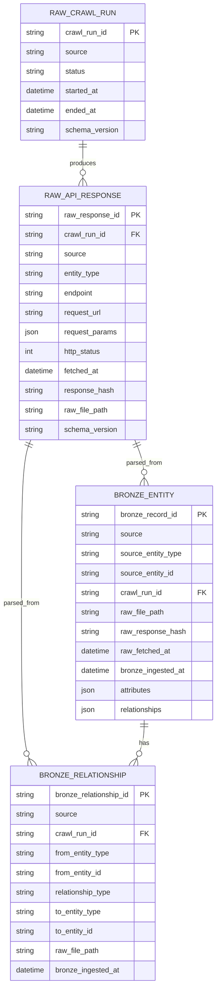

# Bronze Layer

Bronze layer parses raw MangaDex responses into structured records for downstream processing. It stays close to the source shape and does not perform deep business normalization.

## Input

```text
data/raw/mangadex/crawl_run_id=<crawl_run_id>/
  manga/page_000001.json
  chapter/page_000001.json
  cover/page_000001.json
  author/page_000001.json
  tag/page_000001.json
  scanlation_group/page_000001.json
```

Each raw file contains:

```text
crawl_metadata
payload.data[]
payload.limit
payload.offset
payload.total
```

## Output

```text
data/bronze/mangadex/crawl_run_id=<crawl_run_id>/
  manga/entities.jsonl
  chapter/entities.jsonl
  cover/entities.jsonl
  author/entities.jsonl
  tag/entities.jsonl
  scanlation_group/entities.jsonl
  relationships/relationships.jsonl
  ingest_summary.json
  errors/errors.jsonl
```

JSONL is used so each line is one record. This format is easy to inspect locally and easy to load with Spark.

## Bronze Entity

Each entity record represents one item from `payload.data[]`.

```json
{
  "bronze_record_id": "mangadex:manga:<source_entity_id>:<crawl_run_id>",
  "source": "mangadex",
  "source_entity_type": "manga",
  "source_entity_id": "<source_entity_id>",
  "crawl_run_id": "<crawl_run_id>",
  "raw_file_path": "data/raw/mangadex/crawl_run_id=<crawl_run_id>/manga/page_000001.json",
  "raw_response_hash": "<sha256>",
  "raw_fetched_at": "2026-06-02T05:52:19Z",
  "bronze_ingested_at": "2026-06-02T06:00:00Z",
  "attributes": {},
  "relationships": []
}
```

## Bronze Relationship

Each relationship record represents one item from a MangaDex entity `relationships[]` array.

```json
{
  "bronze_relationship_id": "mangadex:manga:<from_id>:author:<to_id>:<crawl_run_id>",
  "source": "mangadex",
  "crawl_run_id": "<crawl_run_id>",
  "from_entity_type": "manga",
  "from_entity_id": "<manga_id>",
  "relationship_type": "author",
  "to_entity_type": "author",
  "to_entity_id": "<author_id>",
  "raw_file_path": "data/raw/mangadex/crawl_run_id=<crawl_run_id>/manga/page_000001.json",
  "bronze_ingested_at": "2026-06-02T06:00:00Z"
}
```

## ERD



## Validation Scope

Bronze performs lightweight validation only:

- `payload.result` is `ok`.
- `payload.data` is a list.
- Entity has `id`.
- Entity has `type`.
- `relationships` is a list when present.

Bronze does not:

- Deduplicate manga or chapters.
- Join author, tag, or cover data into manga.
- Normalize language fields.
- Build API-ready web tables.
- Translate content.

Those steps belong to Silver and Gold layers.
