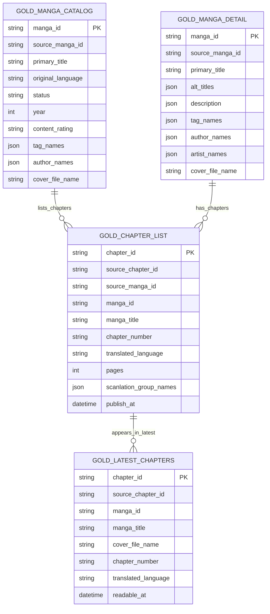

# Gold Layer

Gold layer contains API-ready and analytics-ready tables. It is built from Silver tables loaded into PostgreSQL, using dbt for SQL transformations, tests, and lineage documentation.

## Position In Pipeline

```text
Raw JSON
  -> Bronze JSONL
  -> Silver JSONL
  -> PostgreSQL schema: silver
  -> dbt
  -> PostgreSQL schema: gold
```

Gold is the first layer designed around product and analytics use cases rather than source shape.

## Input

PostgreSQL schema `silver`:

```text
silver.manga
silver.chapter
silver.cover
silver.author
silver.tag
silver.scanlation_group
silver.manga_author
silver.manga_artist
silver.manga_tag
silver.manga_cover
silver.chapter_manga
silver.chapter_scanlation_group
```

## Output

PostgreSQL schema `gold`:

```text
gold.gold_manga_catalog
gold.gold_manga_detail
gold.gold_chapter_list
gold.gold_latest_chapters
```

## Tables

### gold_manga_catalog

Used by manga listing and search pages.

```text
manga_id
source_manga_id
primary_title
primary_title_language
original_language
status
year
content_rating
publication_demographic
tag_names
author_names
cover_file_name
latest_uploaded_chapter
created_at
updated_at
```

### gold_manga_detail

Used by manga detail pages.

```text
manga_id
source_manga_id
primary_title
primary_title_language
alt_titles
description
original_language
available_translated_languages
status
year
content_rating
publication_demographic
tag_names
author_names
artist_names
cover_file_name
created_at
updated_at
```

### gold_chapter_list

Used by chapter lists on manga detail pages.

```text
chapter_id
source_chapter_id
source_manga_id
manga_id
manga_title
title
volume
chapter_number
translated_language
pages
scanlation_group_names
publish_at
readable_at
created_at
updated_at
```

### gold_latest_chapters

Used by homepage/latest updates.

```text
chapter_id
source_chapter_id
source_manga_id
manga_id
manga_title
cover_file_name
title
chapter_number
translated_language
pages
publish_at
readable_at
```

## ERD



## dbt Responsibilities

- Build staging models over `silver`.
- Build gold marts for API and analytics.
- Test primary keys and important fields.
- Document lineage from Silver to Gold.

## Not In Gold

Gold does not crawl, parse raw responses, or call AI translation. Those belong to Crawler, Bronze/Silver, and AI service layers.
