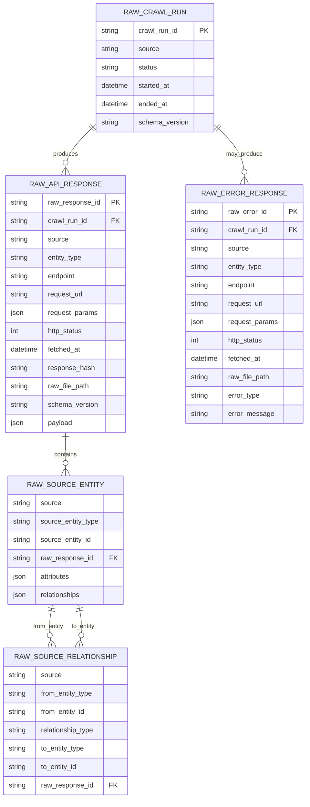

# Raw Layer

Raw layer stores MangaDex API responses as immutable artifacts. The goal is to preserve source data for replay, lineage, debugging, and later parsing into Bronze.

Raw does not normalize business data. It only wraps the original MangaDex payload with crawl metadata.

## Goals

- Preserve the original source response.
- Track crawl run, endpoint, request params, HTTP status, and fetch time.
- Keep enough metadata to replay or debug the pipeline.
- Store failed requests as error artifacts.
- Allow relationship extraction later without losing source shape.

## Input Source

Current source:

```text
MangaDex API
https://api.mangadex.org
```

Current raw entity types:

```text
manga
chapter
cover
author
tag
scanlation_group
```

Future raw entity types:

```text
at_home
page_image_metadata
```

## Folder Structure

```text
data/raw/mangadex/
  crawl_run_id=<crawl_run_id>/
    crawl_run.json
    manga/
      page_000001.json
    chapter/
      page_000001.json
    cover/
      page_000001.json
    author/
      page_000001.json
    tag/
      page_000001.json
    scanlation_group/
      page_000001.json
    errors/
      manga/
        page_000001.json
```

Example crawl run:

```text
data/raw/mangadex/crawl_run_id=20260602T055219Z-0438e6fd/
```

## Crawl Run Document

`crawl_run.json`

```json
{
  "crawl_run_id": "20260602T055219Z-0438e6fd",
  "source": "mangadex",
  "status": "success",
  "started_at": "2026-06-02T05:52:19.391634Z",
  "ended_at": "2026-06-02T05:52:25.606490Z",
  "schema_version": "raw.v1"
}
```

## Raw Response Envelope

Each successful raw response file uses this shape:

```json
{
  "crawl_metadata": {
    "crawl_run_id": "20260602T055219Z-0438e6fd",
    "source": "mangadex",
    "entity_type": "manga",
    "endpoint": "/manga",
    "request_url": "https://api.mangadex.org/manga?limit=10&offset=0",
    "request_params": {
      "limit": 10,
      "offset": 0
    },
    "http_status": 200,
    "fetched_at": "2026-06-02T05:52:20.000000Z",
    "response_hash": "sha256...",
    "schema_version": "raw.v1"
  },
  "payload": {
    "result": "ok",
    "response": "collection",
    "data": []
  }
}
```

`payload` should stay as close as possible to the original MangaDex response.

## Raw Error Envelope

Failed requests are also stored so the pipeline keeps lineage for failures.

```json
{
  "crawl_metadata": {
    "crawl_run_id": "20260602T054133Z-51e52876",
    "source": "mangadex",
    "entity_type": "manga",
    "endpoint": "/manga",
    "request_url": "https://api.mangadex.org/manga?limit=10&offset=0",
    "request_params": {
      "limit": 10,
      "offset": 0
    },
    "http_status": null,
    "fetched_at": "2026-06-02T05:41:37.334499Z",
    "response_hash": null,
    "schema_version": "raw.v1"
  },
  "error": {
    "error_type": "URLError",
    "error_message": "<urlopen error ...>"
  }
}
```

## Raw Relationship Concept

MangaDex entities often include `relationships[]`.

Example source relationships:

```text
manga -> author
manga -> artist
manga -> cover_art
chapter -> manga
chapter -> scanlation_group
cover_art -> manga
```

Raw keeps these relationships inside `payload.data[].relationships`. Bronze can later extract them into relationship records.

## ERD



## Current Successful Crawl Snapshot

Latest successful crawl run:

```text
crawl_run_id=20260602T055219Z-0438e6fd
```

Record counts:

```text
manga:             10
chapter:           10
cover:             10
author:            10
scanlation_group:  10
tag:               77
```

## Raw Layer Rules

- Raw files are immutable.
- Do not rewrite raw payloads after ingestion.
- Do not normalize business fields in Raw.
- Do not join across entity types in Raw.
- Do store failed requests as error artifacts.
- Do keep request params and response hash for replay/debugging.

Normalization begins in Bronze and Silver.
