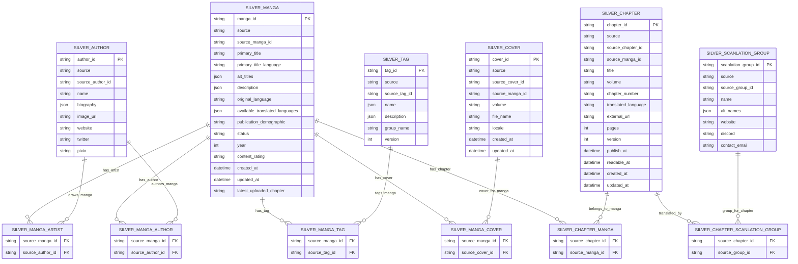

# Silver Layer

Silver layer transforms Bronze source-shaped records into cleaned, normalized domain records. This is the first layer where business meaning becomes explicit.

Silver still stays close to MangaDex as the only source, but it removes nested source noise, extracts key fields, and creates bridge tables for relationships.

## Input

```text
data/bronze/mangadex/crawl_run_id=<crawl_run_id>/
  manga/entities.jsonl
  chapter/entities.jsonl
  cover/entities.jsonl
  author/entities.jsonl
  tag/entities.jsonl
  scanlation_group/entities.jsonl
  relationships/relationships.jsonl
  ingest_summary.json
```

## Output

```text
data/silver/mangadex/crawl_run_id=<crawl_run_id>/
  manga.jsonl
  chapter.jsonl
  cover.jsonl
  author.jsonl
  tag.jsonl
  scanlation_group.jsonl
  manga_author.jsonl
  manga_artist.jsonl
  manga_tag.jsonl
  manga_cover.jsonl
  chapter_manga.jsonl
  chapter_scanlation_group.jsonl
  transform_summary.json
  errors/errors.jsonl
```

## Silver Records

### silver_manga

```text
manga_id
source
source_manga_id
primary_title
primary_title_language
alt_titles
description
original_language
available_translated_languages
publication_demographic
status
year
content_rating
created_at
updated_at
latest_uploaded_chapter
crawl_run_id
bronze_record_id
silver_transformed_at
```

### silver_chapter

```text
chapter_id
source
source_chapter_id
source_manga_id
title
volume
chapter_number
translated_language
external_url
pages
version
publish_at
readable_at
created_at
updated_at
crawl_run_id
bronze_record_id
silver_transformed_at
```

### silver_cover

```text
cover_id
source
source_cover_id
source_manga_id
volume
file_name
description
locale
created_at
updated_at
crawl_run_id
bronze_record_id
silver_transformed_at
```

### silver_author

```text
author_id
source
source_author_id
name
biography
image_url
website
twitter
pixiv
created_at
updated_at
crawl_run_id
bronze_record_id
silver_transformed_at
```

### silver_tag

```text
tag_id
source
source_tag_id
name
description
group_name
version
crawl_run_id
bronze_record_id
silver_transformed_at
```

### silver_scanlation_group

```text
scanlation_group_id
source
source_group_id
name
alt_names
website
discord
contact_email
description
created_at
updated_at
crawl_run_id
bronze_record_id
silver_transformed_at
```

## Bridge Tables

Bridge tables are extracted from Bronze relationships.

```text
manga_author
manga_artist
manga_tag
manga_cover
chapter_manga
chapter_scanlation_group
```

Each bridge keeps:

```text
source
crawl_run_id
from_entity_id
to_entity_id
relationship_type
bronze_relationship_id
silver_transformed_at
```

## ERD



## Validation Scope

Silver performs domain-level checks:

- Manga must have `source_manga_id`.
- Manga should have a non-empty `primary_title`.
- Chapter must have `source_chapter_id`.
- Chapter should have `translated_language`.
- Cover should have `file_name`.
- Author should have `name`.
- Tag should have `name`.

Failed records are written to `errors/errors.jsonl`.

## Not In Silver

Silver does not build final web views, search indexes, or analytics marts. Those belong to Gold.
